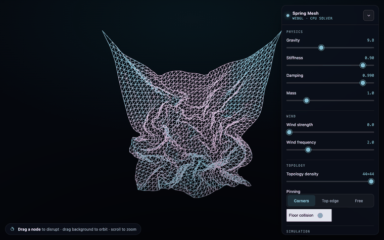

# WebGPU Spring Mesh

**[▶ Live demo](https://erik2810.github.io/webgpu-spring-mesh/)** (requires a WebGPU- or WebGL2-capable browser)



A real-time, GPU-resident particle–mesh spring simulation rendered in the browser
with **WebGPU compute shaders** authored in **Three.js TSL** (Three Shading
Language). A structured lattice of point masses is connected by structural, shear,
and bend springs; the entire integration runs on the GPU, and the cloth can be
disrupted interactively by **clicking and dragging any node**. Browsers without
WebGPU transparently fall back to a CPU solver rendered through the WebGL2 backend.

This is the browser / "JS view" counterpart to the differentiable spring systems
in `jax-spring-sim` and `Mesh-Based-Physics-Simulator`: same mass–spring physics,
here optimized for interactive 60 fps rendering rather than gradients.

```
                pin                       pin
                 o-----o-----o-----o-----o
                 |  \  |  /  |  \  |  /  |     structural  ──
                 o-----o-----o-----o-----o     shear       ╲╱
                 |  /  |  \  |  /  |  \  |      bend        ┄┄ (2 apart)
                 o-----o-----o-----o-----o
                       ↓ drag a node
```

## Physics

The solver is **small-step Position-Based Dynamics** (Müller et al. 2007; Macklin,
*Small Steps in Physics Simulation*, 2019), chosen over explicit springs because
it is **unconditionally stable** — no slider combination can blow it up. Each frame
is split into substeps; each substep runs three phases:

**1. Predict** — integrate external forces (gravity $\mathbf{g}$, oscillating wind
$\mathbf{w}$) into velocity, then advance positions:

$$
\dot{\mathbf{x}}_i \mathrel{+}= \Big(\mathbf{g} + \tfrac{1}{m}\,\mathbf{w}(t)\Big)\Delta t,
\qquad
\mathbf{p}_i = \mathbf{x}_i,\quad
\mathbf{x}_i \mathrel{+}= \Delta t\,\dot{\mathbf{x}}_i
$$

**2. Solve** — project every distance constraint toward its rest length $\ell_{ij}$
with averaged Jacobi sweeps (relaxation factor $s\in[0,1]$ = "stiffness"):

$$
\Delta\mathbf{x}_i = \frac{s}{|\mathcal{N}(i)|}\!\!\sum_{j\in\mathcal{N}(i)}
\Big(\lVert\mathbf{x}_j-\mathbf{x}_i\rVert-\ell_{ij}\Big)\,\hat{\mathbf{d}}_{ij}
$$

**3. Finalize** — recover velocity from the constraint-corrected position delta,
with per-substep viscous damping $\beta$:

$$
\dot{\mathbf{x}}_i = \beta\,\frac{\mathbf{x}_i - \mathbf{p}_i}{\Delta t}
$$

Springs follow the standard cloth model (Provot, *Graphics Interface '95*):
4-neighbour **structural** ($\ell=h$), diagonal **shear** ($\ell=h\sqrt2$), and
2-away **bend** ($\ell=2h$) constraints. Grabbed and pinned nodes are held fixed
through all three phases, so the rest of the sheet relaxes around them.

### GPU data flow

State lives in storage buffers. The constraint solve is ping-ponged each sweep so
neighbour reads never alias the write; an even sweep count lands the result back
in buffer A, which the render materials read:

```
  per substep (compute passes):
    predict ─▶ posA          (gravity/wind, advance)
    solve   ─▶ posA⇄posB     (Jacobi distance projection, ×iterations)
    finalize─▶ posA          (velocity = Δposition / dt, speed for colour)

  render:  InstancedMesh.positionNode ◀── read-only posA
           nodes   = icosahedra, coloured by speed
           springs = screen-facing ribbons, coloured by signed strain
```

Each kernel builds its own storage nodes so WebGPU access modes are inferred
per-pipeline (sharing a node across a read- and a write-kernel makes TSL mark it
read-only and reject the write). Picking reads positions back once per grab via
`getArrayBufferAsync`; dragging then projects the pointer onto a camera-facing
plane through the grabbed node.

## Controls

| Group       | Parameters                                                        |
| ----------- | ----------------------------------------------------------------- |
| Physics     | gravity, stiffness (0–1), damping, mass                           |
| Wind        | oscillating gust strength and frequency                           |
| Topology    | density (`N×N`, rebuilds the mesh), pinning mode, floor collision |
| Simulation  | substeps per frame, reset, pause                                  |

Append `?cpu` to the URL to force the CPU solver even where WebGPU is available.

Drag a node to disrupt · drag the background to orbit · scroll to zoom.

## Stack

- **Vite + TypeScript** build.
- **three @ r185** via the `three/webgpu` + `three/tsl` entry points.
- **WebGPU** compute and rendering, with an automatic **WebGL2 + CPU** fallback.
- Hand-written CSS control overlay (no UI framework).

> Note: this demo uses vanilla Three.js (not React Three Fiber) for tight control
> over the compute/render loop, and a hand-rolled CSS overlay instead of Tailwind,
> to keep the bundle to three.js alone. Both are deliberate deviations from the
> usual Vite + React + Tailwind stack.

## Project layout

```
webgpu-spring-mesh/
├── index.html
├── package.json
├── vite.config.ts
├── tsconfig.json
├── eslint.config.js
└── src/
    ├── main.ts                 # renderer, scene, loop, sim lifecycle
    ├── style.css               # control overlay styling
    ├── core/
    │   ├── params.ts           # SimParams + defaults
    │   ├── topology.ts         # grid + spring graph construction
    │   └── types.ts            # ClothSim interface
    ├── sim/
    │   ├── ClothSimGPU.ts       # TSL compute solver (WebGPU)
    │   └── ClothSimCPU.ts       # JS solver (WebGL2 fallback)
    ├── interaction/
    │   └── PointerDragger.ts    # raycast pick + drag-to-disrupt
    └── ui/
        └── ControlPanel.ts      # glassy DOM control overlay
```

## Setup

```bash
npm install
npm run dev        # http://localhost:5173
npm run build      # type-check + production bundle to dist/
npm run lint       # eslint
npm run typecheck  # tsc --noEmit
```

`base: './'` in `vite.config.ts` keeps the build relocatable, so `dist/` can be
dropped into a portfolio sub-path without rewrites.

## References

- M. Müller, B. Heidelberger, M. Hennix, J. Ratcliff, "Position Based Dynamics,"
  *J. Visual Communication and Image Representation*, 2007.
- M. Macklin, M. Müller, N. Chentanez, "Small Steps in Physics Simulation,"
  *ACM SIGGRAPH / Eurographics SCA*, 2019.
- X. Provot, "Deformation constraints in a mass-spring model to describe rigid
  cloth behaviour," *Graphics Interface*, 1995.
- Three.js Shading Language (TSL) — <https://github.com/mrdoob/three.js/wiki/Three.js-Shading-Language>
